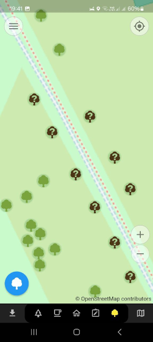
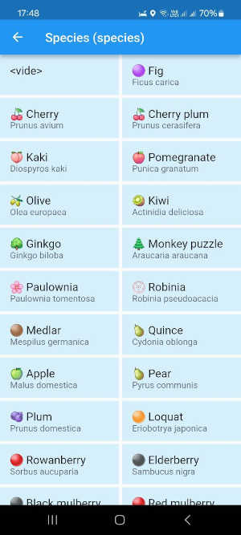

# 🌳 Every Tree 🌲

A plugin for `Every Door` to contribute 🌳 **trees** in OpenStreetMap.


## ⭐ Features

### 👀 Quick survey of tree species

- Trees with known species are green
- Others are in brown



### 🍒 Commons tree species presets

The plugin provides a set of common tree species presets to help you tag tree species.



## 🛠️ How to create the plugin file

### Using bash

```bash
# Create the classic plugin
zip -r every-tree.edp icons/ langs/ LICENSE plugin.yaml

# Create the micro version of the plugin
zip -g every-door-micro.edp icons/ langs/ LICENSE plugin-micro.yaml && zipnote every-door-micro.edp | sed '/@ plugin-micro.yaml/ a @=plugin.yaml' | zipnote -w every-door-micro.edp
```

### Using PowerShell

```powershell
Compress-Archive -Path icons/*, langs/*, LICENSE, plugin.yaml, README.md -DestinationPath every-tree.edp
```

## 📥 How to install the plugin

📲 Scan this QR code with `Every Door` version **6 or later**:


Or [⬇️ download the plugin here](https://raw.githubusercontent.com/Binnette/every-tree/refs/heads/main/every-tree.edp).

[🔍 More information on installation](https://every-door.app/plugins/install/).

### Install the micro version


## 📝 Todo list
- [ ] Ask all my questions to Ilya.
- [ ] Draw custom icons for each tree species.
- [ ] Add a second button for `natural=shrub` with plants :
    - "🍇 Blackberry" species="Rubus fruticosus"
    - "🔴 Raspberry" species="Rubus idaeus"
    - Juniperus communis
    - "Sambucus nigra"
    - "blueberry
    - "🌱 Strawberry" species="Fragaria vesca"