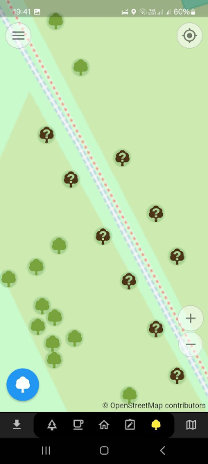
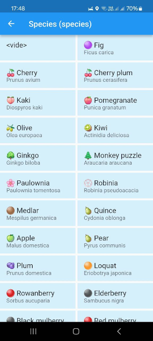

# 🌳 Every Tree 🌲

A plugin for `Every Door` to contribute 🌳 **trees** in OpenStreetMap.


## ⭐ Features

### 👀 Quick survey of tree species

- Trees with known species are **green 🟩**
- Others are in **brown 🟫**



### 🍒 Commons tree species presets

The plugin provides a set of common tree species presets to help you tag tree species.



## 🛠️ How to create the plugin file

### Using bash

```bash
# Remove old files
rm -f every-tree.edp every-tree-micro.edp

# Create the classic plugin
zip -r every-tree.edp icons/ langs/ LICENSE plugin.yaml

# Create the micro version of the plugin
mkdir -p tmp-edp
cp -r icons langs LICENSE tmp-edp/
cp plugin-micro.yaml tmp-edp/plugin.yaml
(cd tmp-edp && zip -r ../every-tree-micro.edp .)
rm -rf tmp-edp
```

### Using PowerShell

```powershell
# Remove old files
Remove-Item every-tree.edp, every-tree-micro.edp
# Create the classic plugin
Compress-Archive -Path icons, langs, LICENSE, plugin.yaml, README.md -DestinationPath every-tree.edp

# Create the micro version of the plugin
New-Item -Type Directory tmp-edp -Force | Out-Null
Copy-Item icons, langs, LICENSE, README.md -Destination tmp-edp -Recurse
Copy-Item plugin-micro.yaml -Destination .\tmp-edp\plugin.yaml
Compress-Archive -Path .\tmp-edp\* -DestinationPath every-tree-micro.edp
Remove-Item tmp-edp -Recurse -Force
```

## 📥 How to install the plugin

📲 Scan this QR code with `Every Door` version **6 or later**:


Or [⬇️ download the plugin here](https://raw.githubusercontent.com/Binnette/every-tree/refs/heads/main/every-tree.edp).

[🔍 More information on installation](https://every-door.app/plugins/install/).

### Install the micro version


## 📝 Todo list
- [ ] Ask all my questions to Ilya.
- [ ] Draw custom icons for each tree species.
- [ ] Add a second button for `natural=shrub` with plants :
    - "🍇 Blackberry" species="Rubus fruticosus"
    - "🔴 Raspberry" species="Rubus idaeus"
    - Juniperus communis
    - "Sambucus nigra"
    - "blueberry
    - "🌱 Strawberry" species="Fragaria vesca"